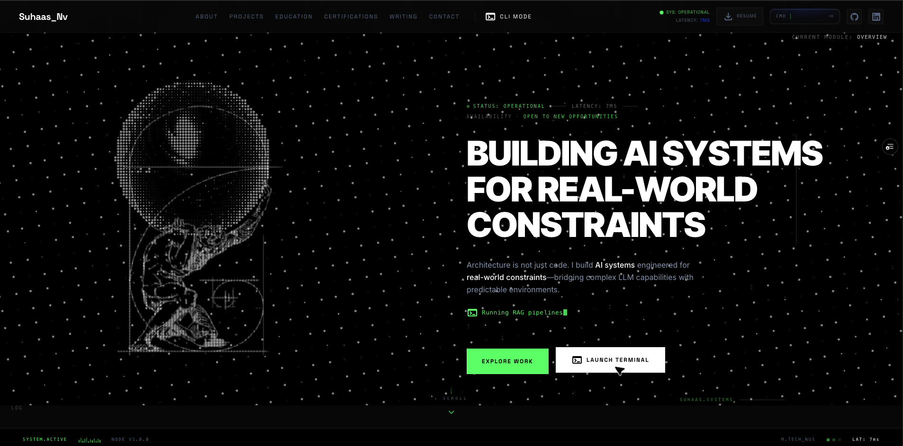

# Vijaya Suhaas Nadukooru

**Software engineer (AI-native full-stack)** · Singapore · M.Tech (Software Engineering), NUS (expected Aug 2026)

I design and ship end-to-end products that combine **LLM orchestration**, **RAG**, **multi-agent workflows**, and **production web stacks**—with emphasis on explainability, security, and real operational impact.

*I still whisper “please behave” before hitting Deploy—so far the apps have better uptime than my sleep schedule.*

---

### Contact & profiles

| | |
|---|---|
| **Email** | [nvijayasuhaas@gmail.com](mailto:nvijayasuhaas@gmail.com) |
| **Phone** | +65 8642 4324 |
| **LinkedIn** | [linkedin.com/in/suhaasnv](https://www.linkedin.com/in/suhaasnv) |
| **GitHub** | [github.com/SuhaasNv](https://github.com/SuhaasNv) |
| **Portfolio website** | [suhaas-nv.vercel.app](https://suhaas-nv.vercel.app/) |

---

### Availability

Full-time internship from **April 2026** onward (3–9 months). Eligible to work in **Singapore**. Strong interest in AI systems, product development, and AI-native SaaS.

---

### Education

- **National University of Singapore** — M.Tech, Software Engineering (Aug 2025 – Aug 2026, expected)
- **Vellore Institute of Technology (VIT)** — B.Tech, Information Technology (Aug 2021 – Aug 2025)

---

### Technical skills

- **Languages:** Python, TypeScript, JavaScript (ES6+), SQL, Java (foundational)
- **Frontend:** React 18/19, Next.js 16, Vite, Tailwind CSS, shadcn/ui, Framer Motion
- **Backend:** FastAPI, NestJS, Express.js, REST, background tasks, JWT, OAuth 2.0
- **AI / ML:** Agentic systems, multi-agent pipelines, RAG, prompt engineering, explainable AI, LLM orchestration; CNN / TensorFlow–Keras (computer vision)
- **LLM providers:** Google Gemini, OpenAI APIs, Groq (LLaMA), Ollama
- **Data:** PostgreSQL, SQLite, Supabase, Redis, pgvector
- **Infra & security:** Docker, Railway, Vercel, AWS (foundational), Azure; RLS, rate limiting, secure headers, OWASP-oriented hardening

---

### Featured projects (demos & repos)

| Project | What it is | Live demo | Code |
|--------|------------|-----------|------|
| **SpaceFlow** | AI-powered workspace optimization: booking, QR check-in/out, utilization vs planned occupancy, explainable recommendations, NL booking, role-based dashboards | [spaceflow-v1.vercel.app](https://spaceflow-v1.vercel.app/) | [SuhaasNv/spaceflow_v1](https://github.com/SuhaasNv/spaceflow_v1) |
| **LoanWise AI** | Multi-agent loan origination: risk, policy, recommendations, decision letters, bias detection, document verification, manager tooling | [loanwise-ai-weld.vercel.app](https://loanwise-ai-weld.vercel.app/) · [API docs (Railway)](https://loanwise-ai-backend-production.up.railway.app/docs) | [SuhaasNv/loanwise-ai](https://github.com/SuhaasNv/loanwise-ai) |
| **Signal (ACIA)** | Autonomous competitive intelligence: scrape → parse → baseline delta → Gemini insights only when change matters; Bright Data, optional web agent & memory layer | [acia-autonomous-competitive-intelli.vercel.app](https://acia-autonomous-competitive-intelli.vercel.app/) | [SuhaasNv/signal-acia](https://github.com/SuhaasNv/signal-acia) |
| **Signal demo competitor (“Acme AI”)** | Sample SaaS site used to demo pricing monitoring (landing, `/pricing`, admin price edits) | [demowebsite-blush.vercel.app](https://demowebsite-blush.vercel.app/) | [SuhaasNv/demowebsite](https://github.com/SuhaasNv/demowebsite) |
| **DocuMind** | Document RAG: PDF ingestion, chunking, embeddings, pgvector retrieval, SSE streaming chat, BullMQ jobs, source attribution | [docu-mind-delta.vercel.app](https://docu-mind-delta.vercel.app/) | [SuhaasNv/DocuMind](https://github.com/SuhaasNv/DocuMind) |
| **VoyageAI** | End-to-end AI travel planning: NL → itineraries, trip chat, Travel DNA, Mapbox, packing lists, PDF ticket parsing, Redis caching & rate limits | — | [github.com/SuhaasNv](https://github.com/SuhaasNv) |
| **Plant disease recognition (LeafScan AI)** | CNN over 38 classes (~95% accuracy), FastAPI inference, Next.js UI, non-leaf rejection, Gemini plant assistant | [plant-leaf-disease-detection-two.vercel.app](https://plant-leaf-disease-detection-two.vercel.app/) · [Streamlit](https://plant-leaf-disease-detection-suhaas.streamlit.app/) | [SuhaasNv/Plant-leaf-disease-detection](https://github.com/SuhaasNv/Plant-leaf-disease-detection) |

**Deep dives:** SpaceFlow, DocuMind, and Plant Disease have **[written case studies](https://suhaasnv.github.io/portfolio/)** on the portfolio (e.g. [SpaceFlow](https://suhaasnv.github.io/portfolio/work/spaceflow.html), [DocuMind / RAG](https://suhaasnv.github.io/portfolio/work/ai-knowledge-assistant.html), [Plant disease](https://suhaasnv.github.io/portfolio/work/plant-disease-recognition.html)).

---

### More projects & tools

**Browser extensions**

- **YouTube Ad Blocker Pro** — Chrome extension (Manifest V3) for YouTube: blocks/skip ads, SponsorBlock-style segment skipping, themes, analytics dashboard, playback shortcuts, optional focus mode. [Repo](https://github.com/SuhaasNv/Youtube-Ad-Blocker)
- **Todo Extension** — Chrome extension for tasks with add / complete / delete and lightweight UI polish. [Repo](https://github.com/SuhaasNv/Todo-Extension)

**Automation & domain tooling**

- **ThreadWise** — Oil & gas completion workflows: pulls vendor connection specs with Playwright, runs body calculations and deterministic logic, fills engineering release Excel templates (Python, Pydantic). [Repo](https://github.com/SuhaasNv/ThreadWise)

**Other public repos**

- **HireLens AI** — Explainable AI simulating ATS, recruiter, and interviewer-style signals for resume screening and interview readiness. [Repo](https://github.com/SuhaasNv/hirelens-ai)
- **JobHunt-AI** — [Repo](https://github.com/SuhaasNv/JobHunt-AI)
- **weather-app** — [Repo](https://github.com/SuhaasNv/weather-app)
- **ArtVault (NFT platform)** — [Live demo](https://artvault-nft-platform.vercel.app/) · [Repo](https://github.com/SuhaasNv/artvault-nft-platform)

[Browse all repositories →](https://github.com/SuhaasNv?tab=repositories)

---

### Certifications

- AWS Certified Cloud Practitioner  
- Microsoft Azure Administrator (AZ-104)  
- Generative AI (IBM)  
- Additional certificates and learning (NUS ISS, Atlassian Jira, etc.) are listed with links on **[the portfolio](https://suhaasnv.github.io/portfolio/)**.

---

### Selected writing

- [RAG without the theater](https://suhaas-nv.vercel.app/writing/rag-without-theater)  
- [Problem framing before the stack](https://suhaas-nv.vercel.app/writing/why-we-build)  
- [Claude and agentic building](https://suhaas-nv.vercel.app/writing/claude-agentic)
